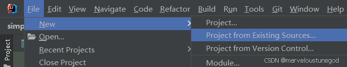
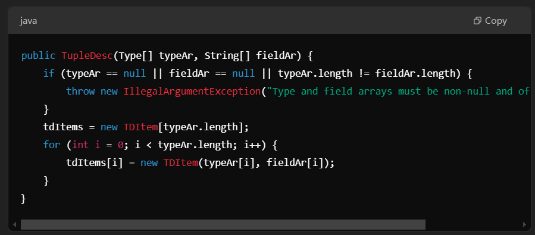

# 0. Environment Setup
在IDEA里进行环境配置  
  
在环境配置的时候碰到了lib加载的问题，解决方案如下：  
  
    
导入lib文件夹里的文件即可    
  
在项目的文件夹里打开 **PowerShell/cmd**，输入：

```sh
ant test
```
结果如下图所示。

虽然与文档中的 **expected output** 不太一致，但应该算配置成功了。判断是否成功的主要依据是：
> The key point is that `ant test` successfully compiles and runs the tests. This is evident from the log showing that JUnit is executing the tests (`Running simpledb.AggregateTest`).

与 **expected output** 不一致的可能原因：
- 你的代码实现的状态
- 具体的测试是否通过或失败
- 你的环境配置（例如 Java 版本、Ant 版本等）

# 1. Getting started

## 1.1 Running End-to-End Tests

介绍 **ant systemtest** 失败或者成功的情形。

如果想自己加测试数据，该如何操作？


## 1.2 Working with an IDE

**Lab1** 文档里包含如何在 **Eclipse** 里构建这个项目的详细说明，但我用的是 **IDEA**。

## 1.3 Implementation Hints

**SimpleDB** 的实现顺序：
<ol type="a">
    <li>管理 <strong>tuples</strong> 的类: <code>Tuple</code>, <code>TupleDesc</code></li>
    <li><code>Catalog</code></li>
    <li><code>BufferPool</code> 构造函数和 <code>getPage()</code> 方法</li>
    <li>访问方法: <code>HeapPage</code>, <code>HeapFile</code> 及相关 ID 类</li>
    <li>操作符 <code>SeqScan</code></li>
    <li>通过 <code>ScanTest</code> 系统测试</li>
</ol>

## 1.4. Transactions, locking, and recovery
- 你的代码接口需要支持 **事务 ID** 的传递，即便目前这些功能还未实现。

- 测试代码会生成一个 **虚拟事务 ID**，你需要正确地将它传递到查询操作符和缓冲池中。

- 未来的实验中会要求你实现 **事务** 和 **锁定** 功能，所以现在保留相关接口是为将来的开发做好准备。

---

# 2. SimpleDB Architecture and Implementation Guide

**SimpleDB** 由以下部分组成：
- **Classes that represent fields, tuples and tuple schemas**
  - **字段（Field）**: 数据表的基本单位，例如 “学生” 表中的 “姓名” 列的值。
  - **元组（Tuple）**: 表中的一行数据，例如 `(101, 张三, 20)`.
  - **元组模式（Tuple Schema）**: 定义字段的名称、类型和顺序，例如 `(ID: Integer, Name: String, Age: Integer)`.
  
- **Classes that apply predicates and conditions to tuples**
  - **谓词（Predicate）**: 代码中实现的条件过滤函数，例如 `Predicate.filter(Tuple)`.
  - **条件（Condition）**: 例如 `age > 18`.

- **访问方法 (Access Methods)**
  - 例如 `heap files`，数据无序存储于磁盘，提供遍历表中数据的方法。

- **操作符类**
  - 例如 `select`, `join`, `insert`, `delete` 等。

- **缓冲池（Buffer Pool）**
  - 负责缓存活跃的元组和页面，避免频繁磁盘 I/O。
  - 处理并发控制和事务（本实验暂不涉及）。

- **目录（Catalog）**
  - 存储数据库表及其模式（schema）信息，相当于数据库的“字典”。
    

## 2.2 Fields and Tuples
### Exercise 1

***

* src/java/simpledb/storage/TupleDesc.java

***

1. **`iterator()` 函数**  
通过 **将 tuple 转换为 `List`，然后获取 `List` 的迭代器** 实现 `iterator()` 方法。
   
2.  此时`tdItems` 报错，定义 `tdItems`:
    
3. 在函数的constructor里初始化 `tdItems`。

   

#### Java 类中的成员变量：
| 变量类型 | 关键字 | 特性 |
|----------|--------|---------|
| **普通成员变量** | `private int a;` | 值可修改，每个对象有独立值。 |
| **final 成员变量** | `private final int b;` | 只能赋值一次，构造函数中初始化。 |
| **static 变量** | `private static int c;` | 属于类，所有对象共享。 |
| **static final（常量）** | `private static final int d = 100;` | 类级常量，所有对象共享，不能修改。 |

#### 哈希值
- 定义：一个固定长度的整数，用于唯一标识对象。
- 作用：
  - 快速查找对象（如在 HashMap 和 HashSet 中）。
  - 检查对象是否相等。
  - 校验数据完整性。
  - 在分布式系统中用于数据分片和负载均衡。

写完TupleDesc.java后，在test文件夹里运行即可


***

* src/java/simpledb/storage/Tuple.java

***

### 设计思路
1. 明确Tuple代表什么
   - Tuple（元组）是数据库中的一行数据，类似于关系数据库的一条记录。
   - 每个Tuple由多个字段（Field）组成，每个字段有自己的数据类型，这些类型由TupleDesc（元组描述符）定义。  
   **所以Tuple 至少需要包含：**
   - 元组的模式（TupleDesc）
   - 存储字段值的数组（Field[]）
2. 设计类的成员变量
   - TupleDesc：确保 Tuple 知道自己有多少个字段，每个字段的类型是什么。
   - fields 数组：存储 Tuple 真实的数据内容，数组长度应与 TupleDesc 的字段数一致。
3. 设计构造函数（目标）
   - 确保 Tuple 的结构是完整的（必须有 TupleDesc）。
   - 初始化 fields 数组，使其大小符合 TupleDesc 的定义。

## 2.3 Catalog
### Exercise2
***

* src/java/simpledb/common/Catalog.java

***
数据库查询常用映射关系，比如sql：select * from *，用的就是映射关系，Catalog.java作为存储元数据的文件（包含多个数据库对象的schema，需要map来进行对应），构造constructor时根据下面的函数使用到的数据创建不同的映射关系（HashMap）。

关于Catalog的设计:
1. id -> 文件 table
2. id -> 文件名 tableName
3. id -> 主键 field
4. tableName -> id 

前三个试为了方便查询，第四个是为了方便通过表名查询表id。如果没有tableName -> id (单向映射)，就需要遍历所有的表来找到对应的id，效率低下，时间复杂度是 O(n)。而如果是双向映射，查询表id和用这个id在tables中取出文件或其他信息的时间复杂度都是 O(1)。


## 2.4 BufferPool
### Exercise3
***

* src/java/simpledb/storage/BufferPool.java

***
### **BufferPool 的核心作用**

| **作用**            | **解释** |
|--------------------|------------------------------|
| **减少磁盘 I/O**   | 数据先存入内存，避免频繁读取磁盘 |
| **提高查询效率**   | 数据库可以从 BufferPool 直接获取数据 |
| **管理数据页（Pages）** | 维护哪些数据页在内存中，哪些需要替换 |
| **支持事务**       | 提供 **脏页管理** 和 **缓冲刷盘（Flush）** 机制，保证事务一致性 |

### 为什么 BufferPool 要用 Map，当缓存为什么要用 Map？
**缓存的本质：Key → Value 的快速查找。**

这里的 Key 是 PageId，Value 是内存里的 Page 对象。 用 Map（哈希表）可以把命中查找做到平均 O(1)。
## 2.5 HeapFile access method
### Exercise4
***

* src/java/simpledb/storage/HeapPageId.java
* src/java/simpledb/storage/RecordId.java
* src/java/simpledb/storage/HeapPage.java

***

#### HeapPage
**HeapPage** 代表数据库文件中的一个数据页（Page），它是数据库存储的最小单位。每个 HeapPage 负责存储一定数量的元组（Tuple），并维护页面的元数据。

| 层级      | 对应类        | 含义                                   |
|-----------|---------------|----------------------------------------|
| HeapFile | `HeapFile`    | 表的数据文件，管理所有页面的存取       |
| Page     | `HeapPage`    | 页（固定大小块），负责存放 slot 和 header |
| Slot     | 位图 + offset 逻辑控制 | 页中的格子，每个 slot 存一个 tuple     |
| Tuple    | `Tuple`       | 表中的一条记录（行）                   |

1. **从磁盘读取字节数据来创建 HeapPage**  
       计算机存储数据时，通常会将数据分页存储在磁盘上。要使用这些数据，就需要从磁盘读取它们，并按照特定格式解析成可操作的结构。HeapPage 就是这样的一个数据结构，它用于存储一页（Page）的数据。
2. **HeapPage 的结构**  
       HeapPage 主要包含两个部分：
   - **Header（头部字节）**：用来记录该页面（Page）中的哪些槽（Slot）已经被使用，哪些是空的。这部分类似于一个位图（bitmap），每个槽对应一个标志位（bit），如果该位是 1，表示该槽已被占用；如果是 0，表示该槽为空，可以存放新的数据。
   - **Tuple Slots（元组槽位）**：用于存放真正的数据，每个槽位存储一条元组（Tuple）。元组可以理解为数据库中的一行数据。

#### HeapPage这样设计的好处
- **快速查找空槽**：有了 Header 记录哪些槽位被占用，系统就可以很快地找到空闲位置，而不用遍历整个页面的数据。
- **支持高效的插入和删除**：当数据插入或删除时，只需要修改 Header，而不必移动大量数据，提高了性能。
- **方便分页管理**：数据库通常使用分页存储数据，每个页面可以独立管理，不同页面之间可以快速定位。

#### 概念厘清
 
- **Slot** 是数据页内管理记录的结构，用于指向实际存储数据的偏移量（存储位置）。
  
- **Bitmap**是一种紧凑的二进制数据结构（由 0 和 1 组成的数组），用于高效存储和处理布尔值（true/false）信息，常用于索引、数据压缩和存储管理。
  
- **final** - The HeapPageId uniquely identifies a page. Once created, its table identifier and page number should never change

- **== 和equals的区别：**
  - ==(比较的是对象的引用地址 - 是否是同一个对象):
    - 比较基本数据类型（int、char、boolean 等），因为基本数据类型存储的是值本身。
    - 用于比较对象是否是同一个实例（内存地址是否相同）
    - 用于比较 null
  - equals: 用于比较对象的内容

#### 关于isSlotUsed()的设计

概念了解

- header 是一个 byte 数组，每个字节负责“8 个slot”的状态，相当于一个slot占一个bit。
- 比如有16个slot，那么header就需要2个byte ceil（16/8）=2。header[0] → 控制 slot 0–7，header[1] → 控制 slot 8–15。
- All Java virtual machines are **big-endian**.所以对于 header[0]，bit 0 是最低位，bit 7 是最高位。

  | 位编号 | 7 | 6 | 5 | 4 | 3 | 2 | 1 | 0 |
  |--------|---|---|---|---|---|---|---|---|
  | 值     | 1 | 0 | 1 | 1 | 0 | 1 | 0 | 1 |

关于isSlotUsed()的设计

- 首先得确定 slot 在 header 中的位置，在header[几]里 / 在哪个byte里
- 确定 slot 在 header[几]里的位置 / 哪个bit
- 举例如下，header[0] = 10110101，然后在第6位
- 然后我们需要把 header[0] 右移6位，变成 00000010（big-endian），这样就能使得第6位变成最低位
- 最后 & 1（00000001），判断最低位是0还是1

### Exercise 5
***

* src/java/simpledb/storage/HeapFile.java

*** 


- **HeapFile** 是多个 HeapPage 组成的数据库文件，它负责管理整个表的数据，包括存取、修改和组织数据页面。
- 实现 HeapFile.readPage(PageId pid)，从磁盘读取某一页，自己算偏移（从文件里精确地定位到那一页的位置，然后读出它的字节数据），不要走 BufferPool （BufferPool缓存的是Page）
- 实现 HeapFile.iterator()，用 BufferPool.getPage 获取页，再从页取 tuple

#### iterator() -- 对HeapFile进行迭代，以便能够一条一条地读取存储在 HeapPage 里的数据。
1. **数据库的表（HeapFile）是怎样存的？**
   HeapFile (表)
   ├── HeapPage 0  → [tuple0, tuple1, tuple2]
   ├── HeapPage 1  → [tuple3, tuple4]
   ├── HeapPage 2  → [tuple5, tuple6, tuple7, tuple8]
   ...
2. **iterator() 的作用是？**
   从第一页开始 → 遍历里面的 tuple → 下一页 → 再遍历 → … 直到最后一条
3. **匿名内部类是什么?**  
匿名内部类（Anonymous Inner Class）是一种没有名字的类，通常在定义并实例化时同时创建。它的主要作用是简化代码，当一个类只在某个特定地方使用一次时，可以用匿名类代替普通类。  
    ``` java
   return new DbFileIterator() { 
        // 这里是匿名内部类的实现
    };
    ```
4. **为什么使用iterator？**
   数据量大，不能一口气把所有 tuple 全读进内存 -> 数据库“流式读取”，不会内存爆炸
5. **为什么要用匿名内部类?**
   - 这个迭代器只在 iterator() 方法中使用，不需要单独创建类。
      
   - 我们需要一个遍历 HeapFile 的方法，能：
     - 按顺序访问 HeapPage 
     - 按顺序访问 HeapPage 里的 Tuple 
     - 支持 hasNext() 和 next() 访问数据 
     - 支持 rewind() 重新开始遍历 
     - 支持 close() 释放资源
   - 这基本就是Java 的迭代器模式（Iterator Pattern）。（仿照Java的Iterator类写DbFileIterator），多一个void open() - 初始化迭代器，开始遍历 HeapFile

5. **为什么用PageId不用HeapPageID?**     
支持多态（不同类型的 Page ID），代码更解耦（BufferPool 只依赖 PageId），可扩展性强（以后可以用 BTreePageId）。

## 2.6 Operators
### Exercise 6
***

* src/java/simpledb/execution/SeqScan.java

***

- **operator**:
  - 数据库中的 Operator（操作符） 主要用于 查询处理（Query Processing），它们组成查询执行计划（Query Execution Plan），可以理解为数据库的“计算单元”。
    关系代数操作符，对应 SQL 语句的基本操作（SELECT，JOIN等）；物理执行操作符，在底层实现查询。
  - 例如SELECT name FROM student WHERE grade > 80; 它的执行过程（查询计划）大概是这样的：SeqScan（顺序扫描整张 student 表，读出所有 tuple） → Filter（筛选出 grade > 80 的 tuple） → Project（只留下 name 列）
  - 这些算子是“链”起来工作的，每个算子可以把“下一级算子”作为输入
  - 查询计划是一棵树 （最下面的选手（SeqScan）从磁盘“取数据”，一路往上传递给上面的选手）
    Project
    ↑
    Filter
    ↑
    SeqScan  ← 叶子节点，直接访问磁盘
  - 最底层的算子是访问方法（Access Method），它们直接去磁盘拿数据，不依赖其他算子
- **查询计划（Query Plan**）是一个操作符组成的“树”:
  - 根操作符（Root Operator） 在最上层，负责返回最终查询结果。 
  - 叶子操作符（Leaf Operator） 负责从磁盘读取数据。 
  - 中间操作符（Intermediate Operators） 可能会对数据进行过滤、连接、排序等处理。
- **查询执行**是自顶向下调用 getNext()，自底向上传递数据:
  - 程序调用 getNext() 让根操作符获取数据。 
  - 根操作符会调用它的子操作符的 getNext()，一直往下调用，直到到达叶子操作符。 
  - 叶子操作符从磁盘读取数据，然后把 Tuple 向上传递。 
  - 数据在查询计划中不断传递、合并、过滤，直到最终返回给用户。

#### SeqScan（顺序扫描）要做的事
1. 找到表（通过 tableId）
2. 获取它的 DbFile.iterator()
3. 依次返回所有 tuple

#### reset的作用
如果你扫描完一张表后，还想用同一个 SeqScan 对象去扫另一张表，不用重新创建新对象，只要调用reset()，把tableId和tableAlias换掉就行了。

#### 遇到报错 
  
**`HeapPage.java` 中 `numSlots` 计算错误**
错误代码：
```java
    private int getHeaderSize(){
        return (int) Math.ceil(numSlots / 8);
    }
```
**错误原因**：
- `42 / 8 = 5.25`，但 `return numSlots / 8;` 计算的是 **整数** `5`，需要 `6` 个字节存储 42 个 Slots，导致越界。

**修改后代码：**
```java
private int getHeaderSize() {
    return (int) Math.ceil(numSlots / 8.0);
}
```

## Summary
完成以上代码之后，可以实现一个数据库的简单查询（比如SELECT * FROM table）
比如我们有一个文本文件：
```angular2html
1,1,1
2,2,2
3,4,4
```
想实现类似：SELECT * FROM some_data_file
```
package simpledb;
import java.io.*;

public class test {

    public static void main(String[] argv) {

        // construct a 3-column table schema 
        Type types[] = new Type[]{ Type.INT_TYPE, Type.INT_TYPE, Type.INT_TYPE };
        String names[] = new String[]{ "field0", "field1", "field2" };
        TupleDesc descriptor = new TupleDesc(types, names);

        // create the table, associate it with some_data_file.dat
        // and tell the catalog about the schema of this table.
        HeapFile table1 = new HeapFile(new File("some_data_file.dat"), descriptor);
        Database.getCatalog().addTable(table1, "test");

        // construct the query: we use a simple SeqScan, which spoonfeeds
        // tuples via its iterator.
        TransactionId tid = new TransactionId();
        SeqScan f = new SeqScan(tid, table1.getId());

        try {
            // and run it
            f.open(); // 打开扫描器（相当于开始查询）
            while (f.hasNext()) { // // 逐条取出 tuple
                Tuple tup = f.next();
                System.out.println(tup);
            }
            f.close(); // // 查询结束
            Database.getBufferPool().transactionComplete(tid);
        } catch (Exception e) {
            System.out.println ("Exception : " + e);
        }
    }

}
```
